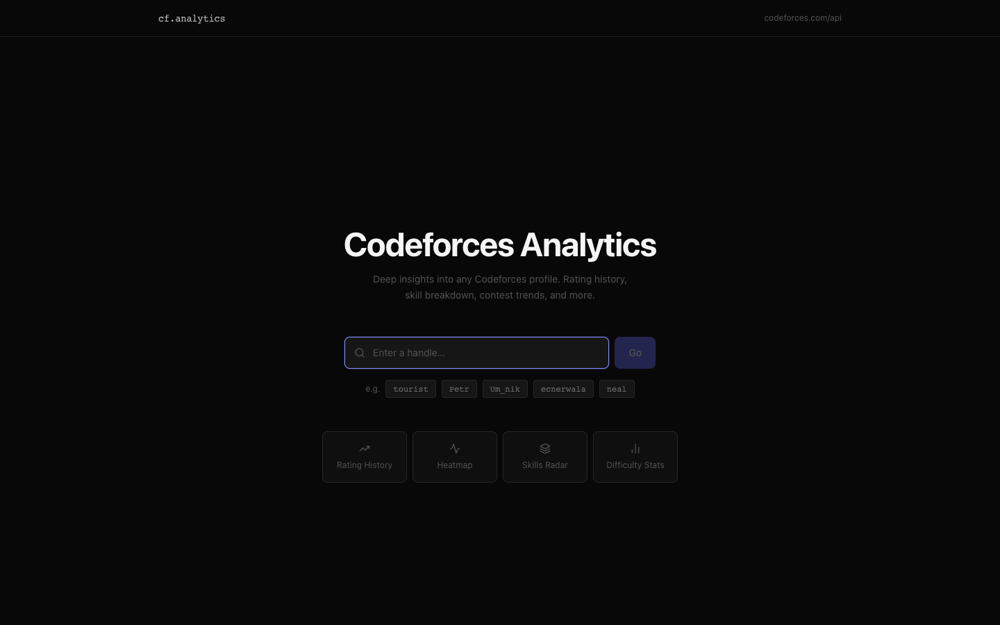
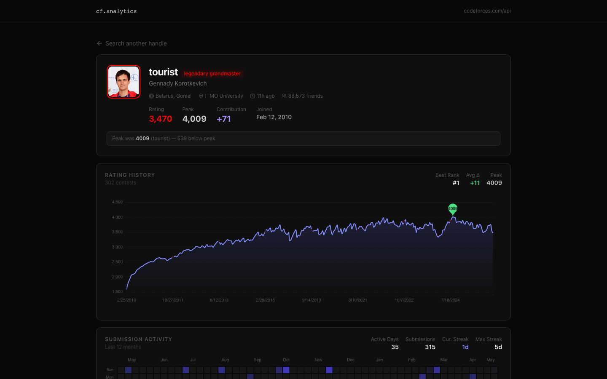
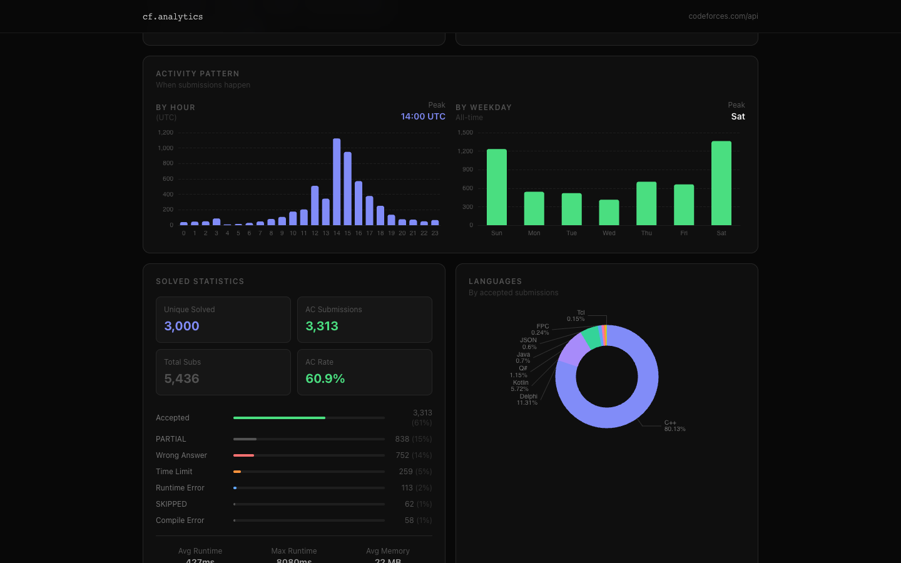
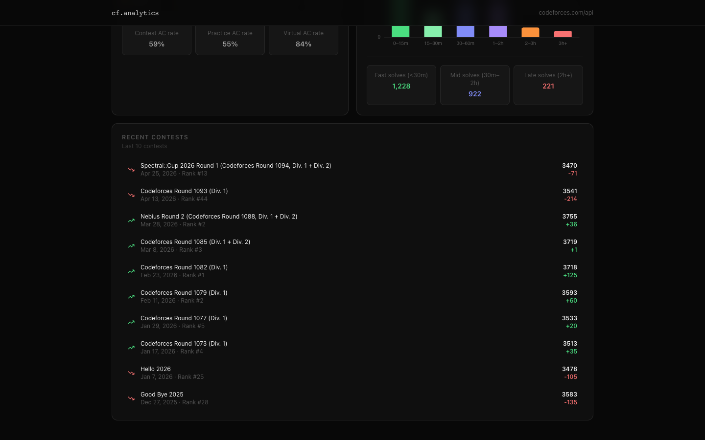
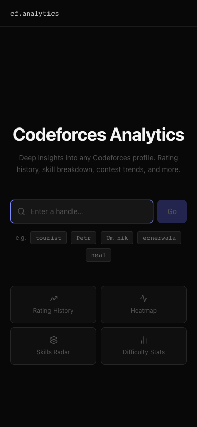

# Codeforces Analytics

> A frontend-only analytics dashboard for any Codeforces profile, built as a hands-on exercise in consuming public REST APIs directly from the browser and building rich data visualizations with React.

**Live demo → [rayveraimar.github.io/codeforces-analytics](https://rayveraimar.github.io/codeforces-analytics/)**



---

## What this project demonstrates

This project was built to practice two things:

1. **Consuming a public REST API from the browser** — the [Codeforces API](https://codeforces.com/api/help) supports CORS, so every request is made client-side with no backend, no proxy, and no API key required. It's a good real-world example of how to fetch, transform, and visualize external data purely on the frontend.

2. **Frontend design with data-heavy UIs** — building charts, heatmaps, radar graphs, and stat cards that are readable, responsive, and visually consistent using Tailwind CSS and Apache ECharts.

---

## Features

All data is fetched live from the Codeforces API on every search — nothing is stored or cached.

| Section | What you see |
|---|---|
| **Profile** | Handle, rank, rating, peak rating, country, org, friends, contribution |
| **Rating History** | Full contest rating chart with rank zones, peak marker, best rank & avg delta |
| **Submission Heatmap** | Last 12 months of activity, current streak, max streak |
| **Skills Radar** | Solved problems by algorithm tag (implementation, dp, graphs, etc.) |
| **Difficulty Distribution** | Problems solved broken down by Codeforces difficulty rating |
| **Activity Pattern** | Submissions by hour of day and day of week — reveals when the user codes |
| **Solved Statistics** | Unique solved, AC rate, verdict breakdown, avg runtime & memory |
| **Languages** | Language distribution across all accepted submissions |
| **Participation Breakdown** | Contest vs. Practice vs. Virtual contest split with per-mode AC rates |
| **Contest Solve Speed** | Histogram of how fast problems are solved relative to contest start |
| **Recent Contests** | Last 10 contests with rank, rating, and delta |







---

## API endpoints used

```
GET https://codeforces.com/api/user.info?handles={handle}
GET https://codeforces.com/api/user.status?handle={handle}&from=1&count=10000
GET https://codeforces.com/api/user.rating?handle={handle}
```

No authentication. No backend. The browser fetches directly — open the Network tab to see it in action.

---

## Stack

| Layer | Tool |
|---|---|
| Framework | React 19 + TypeScript |
| Build | Vite |
| Styling | Tailwind CSS v3 |
| Charts | Apache ECharts via `echarts-for-react` |
| Routing | React Router v6 (HashRouter for GitHub Pages) |
| Icons | Lucide React |

---

## Running locally

```bash
git clone https://github.com/RayverAimar/codeforces-analytics
cd codeforces-analytics
npm install
npm run dev
```

Open `http://localhost:5173` and search any Codeforces handle — try `tourist`, `Petr`, `neal`, or your own.

---

## Building

```bash
npm run build      # outputs to dist/
npm run preview    # preview the production build locally
```

Deployed to GitHub Pages automatically via GitHub Actions on every push to `main`.

---

## Project structure

```
src/
├── api/
│   └── codeforces.ts         # All API calls (3 fetch functions)
├── components/
│   ├── ui/                   # Card, StatBadge
│   ├── ActivityHeatmap.tsx   # Calendar heatmap + streaks
│   ├── ActivityPattern.tsx   # Hour + weekday bar charts
│   ├── ContestHistory.tsx    # Recent contests list
│   ├── ContestSpeed.tsx      # Solve speed histogram
│   ├── DifficultyChart.tsx   # Difficulty distribution bars
│   ├── LanguagesChart.tsx    # Language donut chart
│   ├── PracticeBreakdown.tsx # Contest/Practice/Virtual split
│   ├── ProfileCard.tsx       # User header card
│   ├── RatingChart.tsx       # Rating history line chart
│   ├── SkillsRadar.tsx       # Algorithm tags radar
│   └── SolvedStats.tsx       # Verdict breakdown + runtime stats
├── lib/
│   └── utils.ts              # All data transformation functions
├── pages/
│   ├── HomePage.tsx
│   └── ProfilePage.tsx
└── types/
    └── codeforces.ts         # TypeScript interfaces for the CF API
```

---

## Mobile

Fully responsive — all charts and cards adapt to mobile viewports.


